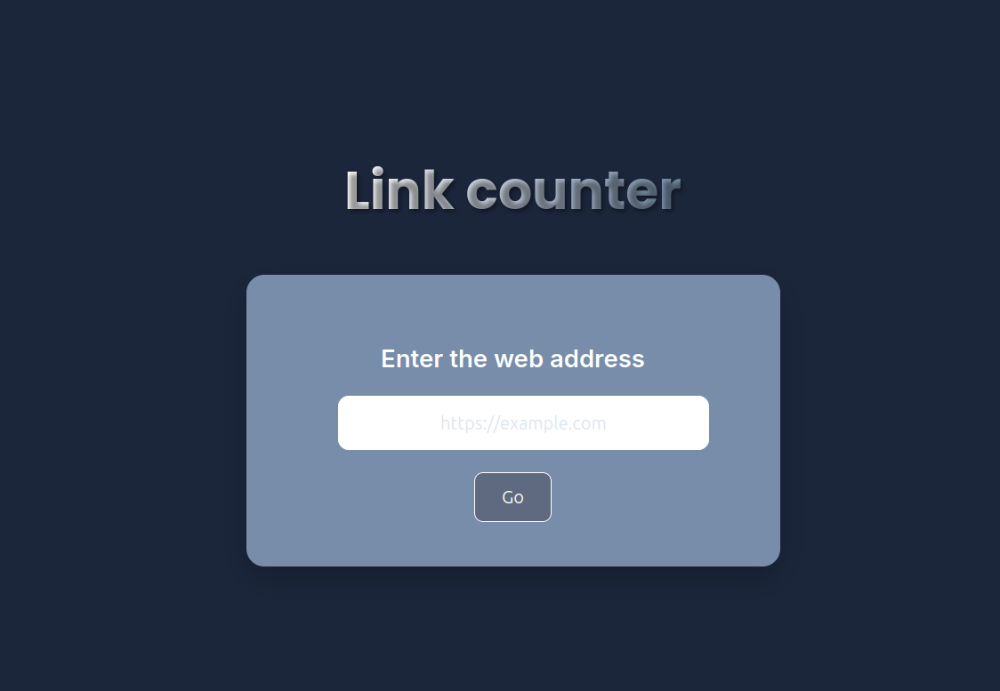
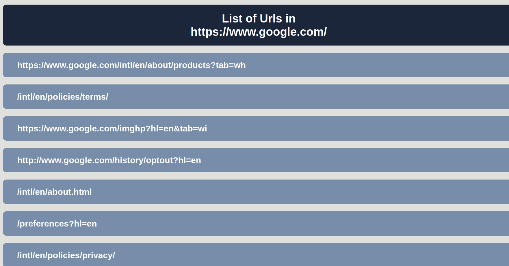

#  Link Counter

A simple web application that extracts and displays **all internal and external links** from a given webpage URL.  
Built using **Python**, **Flask**, and **BeautifulSoup**.

  **Live Demo:** [https://link-counter-flask.vercel.app/](https://link-counter-flask.vercel.app/)  

---
## Screenshots

##  Features
- Extracts **all links** from any valid webpage URL.
- Separates **internal** and **external** links.
- Displays results in a clean, responsive UI.
- Lightweight and fast — perfect for quick SEO checks or web audits.

---

##  Tech Stack
- **Python** – Core programming language
- **Flask** – Backend web framework
- **BeautifulSoup** – HTML parsing and link extraction
- **HTML/CSS** – Frontend interface

---

